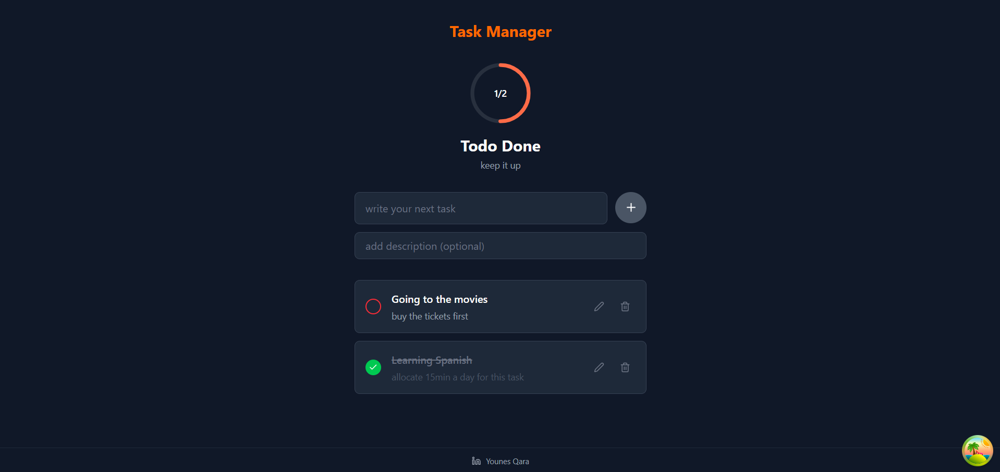
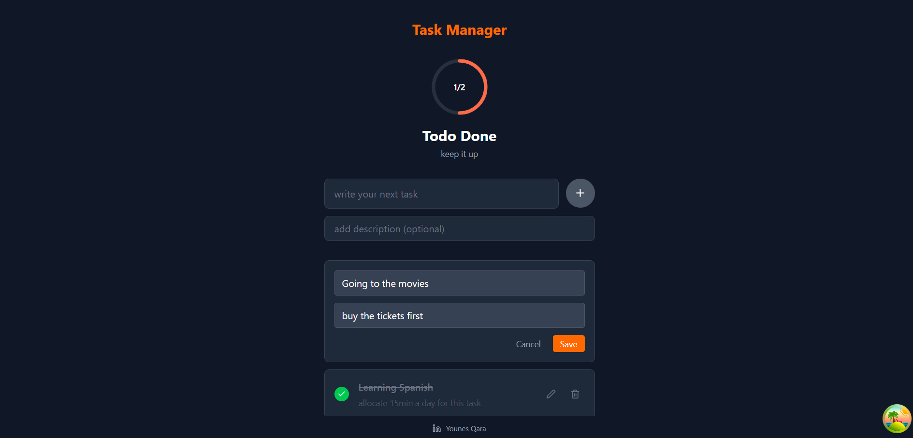

# Task Management Application

A modern fullstack task management application built with React (TypeScript) frontend and Express.js backend.

## Screenshots


*The main task management interface*


*Editing a Task*

## Architecture Overview

This application follows a clean, modular architecture with clear separation of concerns:

### Backend Architecture (`/backend`)
```
backend/
├── src/
│   ├── config/          # Configuration files and environment setup
│   ├── controllers/     # Route handlers and business logic
│   ├── middleware/      # Custom middleware functions
│   ├── routes/          # API route definitions
│   ├── services/        # Business logic and data operations
│   ├── types/           # TypeScript type definitions
│   └── server.ts        # Express server entry point
├── .env                 # Environment variables
├── .env.example         # Environment variables template
└── package.json         # Dependencies and scripts
```

### Frontend Architecture (`/frontend`)
```
frontend/
├── src/
│   ├── assets/          # Static assets (images, icons)
│   ├── components/      # Reusable React components
│   ├── hooks/           # Custom React hooks
│   ├── providers/       # Context providers (React Query, etc.)
│   ├── services/        # API service functions
│   ├── types/           # TypeScript type definitions
│   ├── utils/           # Utility functions
│   ├── App.tsx          # Main App component
│   └── main.tsx         # React application entry point
├── .env                 # Environment variables
├── .env.example         # Environment variables template
└── package.json         # Dependencies and scripts
```

## API Endpoints

The backend provides a RESTful API with the following endpoints:

- `GET /tasks` - Retrieve all tasks
- `POST /tasks` - Create a new task
- `DELETE /tasks/:id` - Delete a task by ID
- `PATCH /tasks/:id` - Update task status (bonus feature)

## Tech Stack

### Backend
- **Express.js** - Web application framework
- **TypeScript** - Type safety and better developer experience
- **Zod** - Runtime type validation and schema validation
- **Cors** - Cross-origin resource sharing
- **Swagger** - API documentation
- **ts-node** - TypeScript execution for development

### Frontend
- **React 19** - UI library with latest features
- **TypeScript** - Static type checking
- **Vite** - Fast build tool and development server
- **TailwindCSS** - Utility-first CSS framework
- **TanStack Query (React Query)** - Server state management and caching
- **Zod** - Client-side validation and type safety
- **Lucide React** - Modern icon library

## Local Development Setup

### Prerequisites
- Node.js (version 18 or higher)
- npm or yarn package manager

### Backend Setup

1. Navigate to the backend directory:
   ```bash
   cd backend
   ```

2. Install dependencies:
   ```bash
   npm install
   ```

3. Set up environment variables:
   ```bash
   cp .env.example .env
   ```
   
   Edit `.env` file with your configuration:
   ```env
   PORT=3001
   NODE_ENV=development
   CORS_ORIGIN=http://localhost:5173
   ```

4. Start the development server:
   ```bash
   npm run dev
   ```

   The backend will be running on `http://localhost:3001`

### Frontend Setup

1. Navigate to the frontend directory:
   ```bash
   cd frontend
   ```

2. Install dependencies:
   ```bash
   npm install
   ```

3. Set up environment variables:
   ```bash
   cp .env.example .env
   ```
   
   Edit `.env` file with your configuration:
   ```env
   VITE_API_BASE_URL=http://localhost:3001
   VITE_APP_TITLE=Task Management App
   ```

4. Start the development server:
   ```bash
   npm run dev
   ```

   The frontend will be running on `http://localhost:5173`

### Running Both Applications

For the best development experience, run both applications simultaneously:

1. Start the backend server in one terminal:
   ```bash
   cd backend && npm run dev
   ```

2. Start the frontend server in another terminal:
   ```bash
   cd frontend && npm run dev
   ```

### Production Build

#### Backend Production Build
```bash
cd backend
npm run build
npm start
```

#### Frontend Production Build
```bash
cd frontend
npm run build
npm run preview
```

## Features

- ✅ **Task Management**: Create, read, update, and delete tasks
- ✅ **Status Toggle**: Mark tasks as pending or completed
- ✅ **Real-time Updates**: Optimistic updates with TanStack Query
- ✅ **Type Safety**: Full TypeScript coverage on both frontend and backend
- ✅ **Input Validation**: Zod schemas for runtime validation
- ✅ **Responsive Design**: Mobile-friendly interface with TailwindCSS
- ✅ **Error Handling**: Comprehensive error handling and user feedback
- ✅ **API Documentation**: Swagger documentation for backend endpoints

## Technical Choices Explained

### Why This Tech Stack?

#### **Express.js over Fastify**
While Fastify offers better performance, I chose Express.js for this project because:
- **Ecosystem Maturity**: Larger community and extensive middleware ecosystem
- **Team Familiarity**: Most developers are familiar with Express.js patterns
- **Swagger Integration**: Seamless integration with swagger-ui-express
- **Rapid Development**: Faster setup for MVP and prototyping

#### **TanStack Query (React Query)**
- **Intelligent Caching**: Reduces unnecessary API calls and improves UX
- **Optimistic Updates**: Immediate UI feedback for better user experience
- **Error Handling**: Built-in retry logic and error boundary integration
- **Background Sync**: Automatic data synchronization when the app regains focus

#### **TailwindCSS**
- **Rapid Prototyping**: Utility-first approach speeds up UI development
- **Consistency**: Design system constraints ensure visual consistency
- **Performance**: Purged CSS results in smaller bundle sizes
- **Maintainability**: Co-located styles make components self-contained

#### **Zod for Validation**
- **Type Safety**: Generates TypeScript types from runtime schemas
- **Isomorphic**: Same validation logic on both client and server
- **Developer Experience**: Excellent error messages and type inference
- **Runtime Safety**: Validates data at application boundaries

#### **TypeScript Throughout**
- **Early Error Detection**: Catch bugs at compile time rather than runtime
- **Better IDE Support**: Enhanced autocomplete, refactoring, and navigation
- **Self-Documenting**: Types serve as living documentation
- **Team Collaboration**: Clearer contracts between frontend and backend

#### **Vite over Create React App**
- **Performance**: Significantly faster development server and builds
- **Modern**: Built for the modern web with ES modules
- **Plugin Ecosystem**: Rich ecosystem with TypeScript and React support
- **Future-Proof**: Actively maintained and evolving

This tech stack provides an excellent balance of developer experience, performance, maintainability, and scalability for a task management application that could grow with business needs.